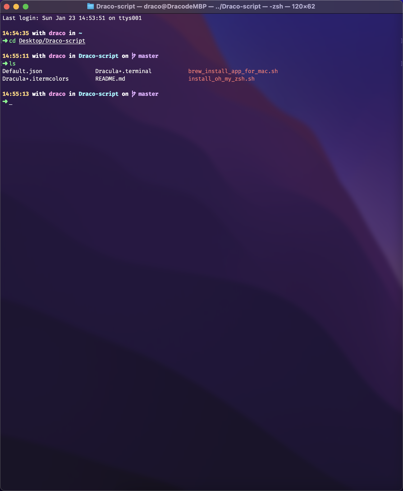
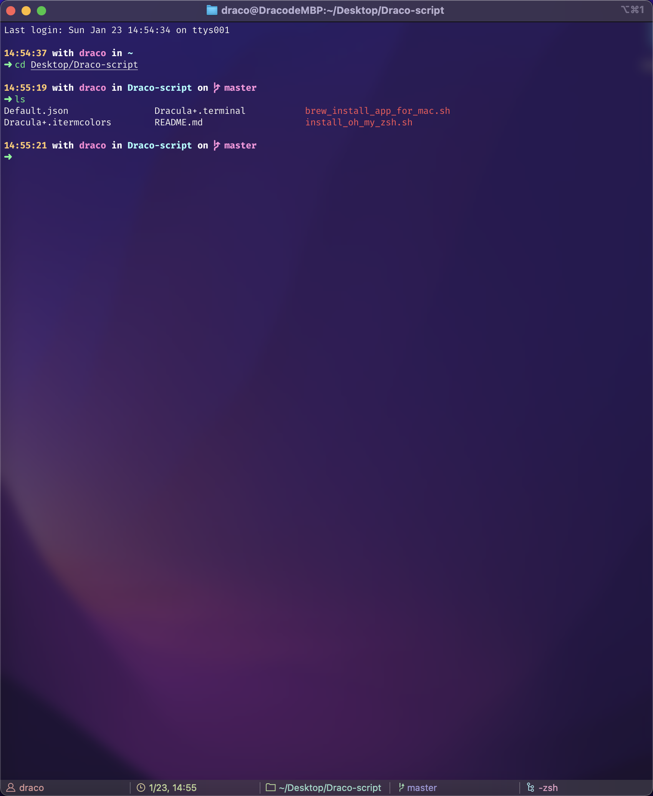

# Draco-script

## 介绍

这是一个为你的Mac自动安装软件的Bash脚本，让你抽出时间喝咖啡而不是把时间花费在下载和安装你需要的软件。

## 开始

1. 克隆本仓库到您的电脑 `git clone https://github.com/Daker-china/Daker-script.git`
2. 进入仓库目录，要执行安装，只需要执行`./brew_install_app_for_mac.sh`即可。如果提示此脚本没有运行权限，请执行`chmod u+x brew_install_app_for_mac.sh`

软件清单分两个，`brew_cask_app_list`为GUI软件包，`brew_cli_app_list`为CLI软件包，这二者都是数组。

## 如何添加自定义的软件包 🔥

这很简单，只需要改写`brew_install_app_for_mac.sh`里面的`brew_cask_app_list`和`brew_cli_app_list`这两个数组即可，你可以删除里面你不想要的软件包，你也可以在对应的数组里面加入你想要的软件包，注意分清GUI和CLI即可。

## 使用

> `./brew_install_app_for_mac.sh`

### iTerm2 + oh-my-zsh 安装配置

安装软件及相关命令
> `./install_oh_my_zsh.sh` 

oh-my-zsh 配置文件
`.zshrc`

iTerm2 Dracula+ 主题文件
`Dracula+.itermcolors`

Terminal Dracula+ 主题文件
`Dracula+.terminal`

Terminal 默认配置文件
`Default.json`

VS Code 字体配置
`'Fira Mono for Powerline', 'Fira Code', Consolas, 'Courier New', monospace`

Terminal && iTerm2 字体配置
`'Fira Mono for Powerline'`

Terminal 效果预览

iTerm2 效果预览

VS Code 效果预览
